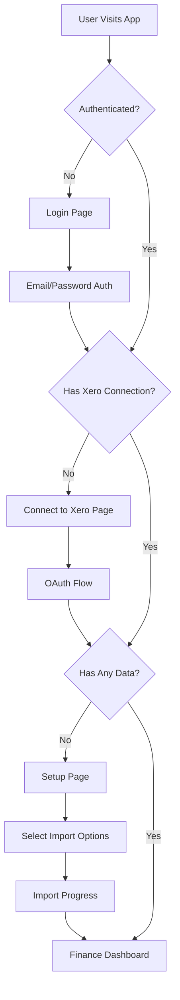
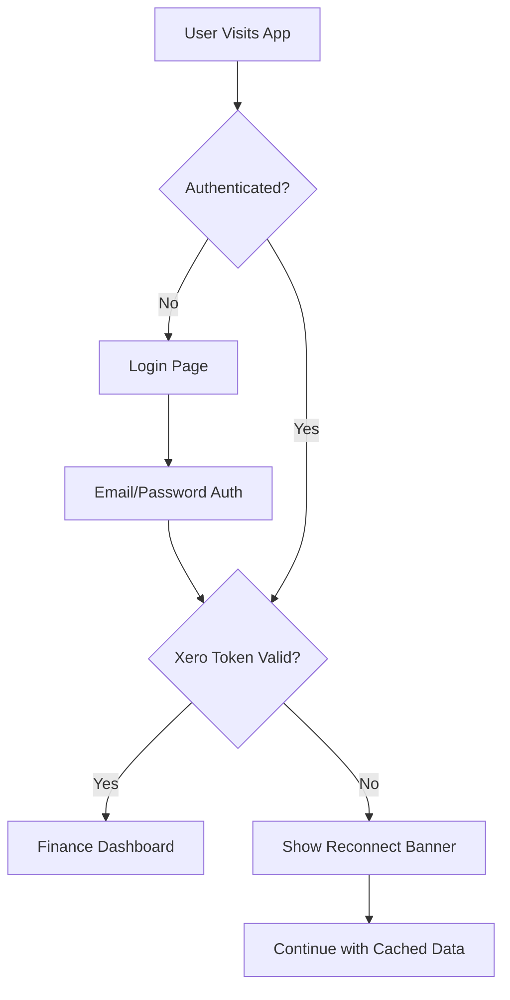

# Authentication & Setup Flow Architecture

## Overview

This document outlines the complete authentication and setup flow for the bookkeeping app, integrating user authentication, Xero OAuth connection, and first-time setup experience.

## Flow States & User Journeys

### 1. First-Time User Journey



### 2. Returning User Journey



## Authentication States

### State Matrix

| User Auth | Xero Token | Has Data | Route Behavior | UI State |
|-----------|------------|----------|----------------|----------|
| ❌ No | - | - | → `/login` | Login page |
| ✅ Yes | ❌ No | ❌ No | → `/connect` | Connect to Xero |
| ✅ Yes | ✅ Yes | ❌ No | → `/setup` | Initial setup |
| ✅ Yes | ❌ No | ✅ Yes | → `/finance` | Offline mode |
| ✅ Yes | ✅ Yes | ✅ Yes | → `/finance` | Full access |

## Implementation Details

### 1. User Authentication Layer

```typescript
// contexts/UserAuthContext.tsx
interface UserAuthState {
  user: User | null
  isAuthenticated: boolean
  isLoading: boolean
  login: (email: string, password: string) => Promise<void>
  logout: () => Promise<void>
  register: (email: string, password: string) => Promise<void>
}

// User model includes setup completion flag
interface User {
  id: string
  email: string
  name?: string
  hasCompletedSetup: boolean
  lastLoginAt: Date
  createdAt: Date
}
```

### 2. Enhanced Auth Context

```typescript
// contexts/AuthContext.tsx (enhanced)
interface AuthContextValue {
  // User authentication
  user: User | null
  isAuthenticated: boolean
  
  // Xero connection
  hasActiveToken: boolean
  organization: XeroOrganization | null
  
  // Data status
  hasData: boolean
  lastSync: Date | null
  dataVersion: string
  
  // Setup status
  hasCompletedSetup: boolean
  setupProgress: SetupProgress | null
  
  // Actions
  login: (email: string, password: string) => Promise<void>
  logout: () => Promise<void>
  connectToXero: () => void
  disconnectFromXero: () => Promise<void>
  syncData: () => Promise<void>
  checkAuthStatus: () => Promise<void>
}
```

### 3. Route Protection & Redirection

```typescript
// middleware.ts
export async function middleware(request: NextRequest) {
  const { pathname } = request.nextUrl
  const session = await getSession(request)
  
  // Public routes
  const isPublicRoute = ['/login', '/register', '/forgot-password'].includes(pathname)
  
  // Not authenticated → login
  if (!session?.user && !isPublicRoute) {
    return NextResponse.redirect(new URL('/login', request.url))
  }
  
  // Authenticated but accessing public routes → redirect to app
  if (session?.user && isPublicRoute) {
    return NextResponse.redirect(new URL('/finance', request.url))
  }
  
  // Check setup completion for authenticated users
  if (session?.user && !isPublicRoute) {
    const setupStatus = await checkSetupStatus(session.user.id)
    
    // No Xero connection → connect page
    if (!setupStatus.hasXeroConnection && pathname !== '/connect') {
      return NextResponse.redirect(new URL('/connect', request.url))
    }
    
    // Has Xero but no data → setup page
    if (setupStatus.hasXeroConnection && !setupStatus.hasData && pathname !== '/setup') {
      return NextResponse.redirect(new URL('/setup', request.url))
    }
  }
  
  return NextResponse.next()
}
```

### 4. Setup Page Flow

```typescript
// app/setup/page.tsx
export default function SetupPage() {
  const [currentStep, setCurrentStep] = useState(1)
  const [importOptions, setImportOptions] = useState<ImportOptions>({
    dateRange: 'last_3_months',
    entities: ['accounts', 'transactions', 'invoices', 'contacts'],
    categories: 'auto_map'
  })
  
  const steps = [
    {
      id: 1,
      title: "Connect to Xero",
      description: "Securely link your Xero account",
      component: <XeroConnectionStep />
    },
    {
      id: 2,
      title: "Select Data to Import",
      description: "Choose what to sync from Xero",
      component: <DataSelectionStep options={importOptions} onChange={setImportOptions} />
    },
    {
      id: 3,
      title: "Configure Settings",
      description: "Set your import preferences",
      component: <ImportSettingsStep options={importOptions} onChange={setImportOptions} />
    },
    {
      id: 4,
      title: "Import Progress",
      description: "Syncing your data",
      component: <ImportProgressStep options={importOptions} />
    },
    {
      id: 5,
      title: "Setup Complete",
      description: "Ready to use your financial hub",
      component: <SetupCompleteStep />
    }
  ]
  
  return (
    <SetupLayout>
      <StepIndicator steps={steps} currentStep={currentStep} />
      <AnimatePresence mode="wait">
        {steps[currentStep - 1].component}
      </AnimatePresence>
    </SetupLayout>
  )
}
```

### 5. Login Page Integration

```typescript
// app/login/page.tsx
export default function LoginPage() {
  const router = useRouter()
  const { login } = useAuth()
  
  const handleLogin = async (credentials: LoginCredentials) => {
    try {
      await login(credentials.email, credentials.password)
      
      // Check where to redirect based on user state
      const setupStatus = await checkSetupStatus()
      
      if (!setupStatus.hasXeroConnection) {
        router.push('/connect')
      } else if (!setupStatus.hasData) {
        router.push('/setup')
      } else {
        router.push('/finance')
      }
    } catch (error) {
      toast.error('Invalid credentials')
    }
  }
  
  return (
    <AuthLayout>
      <LoginForm onSubmit={handleLogin} />
      <div className="mt-4 text-center">
        <Link href="/register">Don't have an account? Sign up</Link>
      </div>
    </AuthLayout>
  )
}
```

### 6. Connect to Xero Page

```typescript
// app/connect/page.tsx
export default function ConnectXeroPage() {
  const { connectToXero, organization } = useAuth()
  const router = useRouter()
  
  // If already connected, redirect
  useEffect(() => {
    if (organization) {
      router.push('/setup')
    }
  }, [organization, router])
  
  return (
    <div className="min-h-screen flex items-center justify-center">
      <div className="max-w-md w-full space-y-8">
        <div className="text-center">
          <h1 className="text-3xl font-bold">Connect to Xero</h1>
          <p className="mt-2 text-gray-400">
            Link your Xero account to import your financial data
          </p>
        </div>
        
        <div className="bg-slate-800 rounded-xl p-8">
          <ul className="space-y-4 mb-8">
            <li className="flex items-start gap-3">
              <Shield className="h-5 w-5 text-emerald-400 mt-0.5" />
              <div>
                <h3 className="font-medium">Secure Connection</h3>
                <p className="text-sm text-gray-400">
                  OAuth 2.0 with bank-level encryption
                </p>
              </div>
            </li>
            <li className="flex items-start gap-3">
              <Database className="h-5 w-5 text-blue-400 mt-0.5" />
              <div>
                <h3 className="font-medium">Your Data, Locally</h3>
                <p className="text-sm text-gray-400">
                  All data is synced to your local database
                </p>
              </div>
            </li>
            <li className="flex items-start gap-3">
              <RefreshCw className="h-5 w-5 text-purple-400 mt-0.5" />
              <div>
                <h3 className="font-medium">Auto-Sync</h3>
                <p className="text-sm text-gray-400">
                  Automatic updates every 30 minutes
                </p>
              </div>
            </li>
          </ul>
          
          <Button 
            onClick={connectToXero}
            className="w-full"
            size="lg"
          >
            <Cloud className="mr-2 h-5 w-5" />
            Connect to Xero
          </Button>
        </div>
        
        <p className="text-center text-sm text-gray-400">
          By connecting, you agree to our{' '}
          <Link href="/terms" className="text-blue-400 hover:underline">
            Terms of Service
          </Link>
        </p>
      </div>
    </div>
  )
}
```

## API Endpoints

### Authentication Endpoints

```typescript
// User authentication
POST   /api/v1/auth/login
POST   /api/v1/auth/logout  
POST   /api/v1/auth/register
GET    /api/v1/auth/session
POST   /api/v1/auth/refresh

// Setup status
GET    /api/v1/setup/status
POST   /api/v1/setup/complete
```

### Enhanced Xero Endpoints

```typescript
// Existing endpoints
GET    /api/v1/xero/auth
GET    /api/v1/xero/callback
POST   /api/v1/xero/disconnect
GET    /api/v1/xero/status

// New setup endpoints
POST   /api/v1/setup/configure   // Save import preferences
POST   /api/v1/setup/import      // Start import with options
GET    /api/v1/setup/progress    // Get import progress (SSE/WebSocket)
```

## Security Considerations

### 1. Session Management
- JWT tokens with refresh tokens
- HttpOnly cookies for session storage
- CSRF protection on all state-changing operations
- Session timeout after 24 hours of inactivity

### 2. OAuth Security
- PKCE flow for Xero OAuth
- State parameter validation
- Redirect URI whitelist
- Token encryption at rest

### 3. Data Protection
- All API routes require authentication
- Role-based access control (future)
- Audit logging for sensitive operations
- Data encryption in SQLite

## User Experience Enhancements

### 1. Progressive Disclosure
- Don't overwhelm first-time users
- Guide through setup step-by-step
- Show progress and time estimates

### 2. Error Recovery
- Clear error messages
- Retry mechanisms for failed imports
- Ability to skip and return to setup

### 3. Onboarding Education
- Tooltips explaining each option
- Preview of what data will be imported
- Success metrics after import

## Implementation Priority

### Phase 1: Core Authentication (Week 1)
1. User authentication endpoints
2. Session management
3. Login/Register pages
4. Protected route middleware

### Phase 2: Setup Flow (Week 2)
1. Setup status tracking
2. Connect to Xero page
3. Basic setup page (steps 1-3)
4. Setup completion flag

### Phase 3: Import Experience (Week 3)
1. Import configuration API
2. Progress tracking (WebSocket/SSE)
3. Import progress UI
4. Error handling

### Phase 4: Polish (Week 4)
1. Animations and transitions
2. Help documentation
3. Skip setup option
4. Re-run setup feature

## Success Metrics

- Time to first value: < 5 minutes from signup
- Setup completion rate: > 80%
- Failed import rate: < 5%
- User confusion points: < 2 per setup

## Future Enhancements

1. **Social Authentication**
   - Google OAuth
   - Microsoft OAuth
   - SAML for enterprise

2. **Team Management**
   - Multiple users per organization
   - Role-based permissions
   - Audit trail

3. **Advanced Setup**
   - Custom field mapping
   - Historical data import
   - Multi-company support

4. **Guided Tours**
   - Interactive onboarding
   - Feature discovery
   - Best practices guide