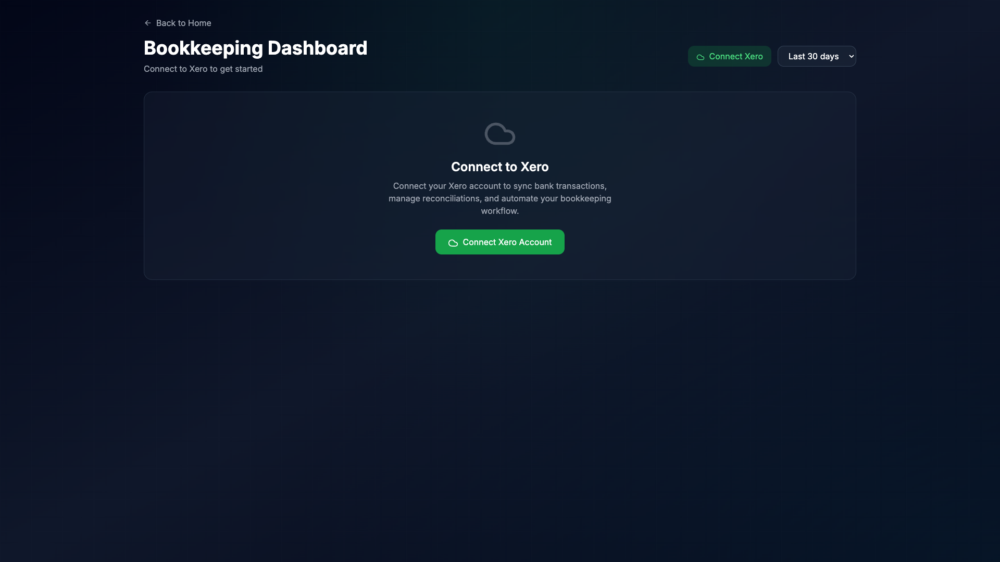

# Bookkeeping Automation App

A modern, intelligent bookkeeping automation application built with Next.js 14 and integrated with Xero accounting software. Features a beautiful dark theme UI with gradient effects and comprehensive transaction management capabilities.

## 🚀 Live Demo

[View Live Demo](http://localhost:3003) (Run locally)

## 📸 Screenshots




## 🛠️ Tech Stack

### Core Framework
- **Next.js 14.2.3** - React framework with App Router
- **React 18.2.0** - UI library
- **TypeScript 5.4.2** - Type safety

### Styling & UI
- **Tailwind CSS 3.4.1** - Utility-first CSS framework
- **Tailwind Animate 1.0.7** - Animation utilities
- **Radix UI** - Unstyled, accessible components
  - Alert Dialog
  - Dialog
  - Dropdown Menu
  - Label
  - Select
  - Toast
- **Lucide React** - Beautiful & consistent icons
- **Class Variance Authority (CVA)** - Component variants
- **clsx & tailwind-merge** - Conditional class utilities

### Data & State Management
- **Prisma 5.11.0** - Next-generation ORM
- **SQLite** - Default database (configurable to PostgreSQL)
- **React Hook Form 7.51.0** - Performant forms with easy validation
- **Zod 3.22.4** - TypeScript-first schema validation
- **TanStack React Query 5.28.4** - Powerful data synchronization
- **TanStack React Table 8.13.2** - Headless table utilities

### External Integrations
- **Xero Node 11.2.0** - Official Xero API SDK
- **XLSX 0.18.5** - Excel file processing
- **Cookie 1.0.2** - HTTP cookie parsing/serialization

### Testing
- **Playwright 1.52.0** - End-to-end testing
- **Jest 29.7.0** - Unit testing
- **React Testing Library** - Component testing

### Development Tools
- **ESLint** - Code linting
- **Prettier** - Code formatting
- **TypeScript ESLint** - TypeScript linting

## 🎨 Design System & Styling Guide

### Color Palette

```css
/* Primary Colors */
--emerald: #10b981 /* Primary actions, success states */
--cyan: #06b6d4    /* Secondary actions, info states */
--purple: #a855f7  /* Accent color, special features */
--amber: #f59e0b   /* Warnings, attention states */
--red: #ef4444     /* Errors, destructive actions */

/* Background Colors */
--slate-900: #0f172a /* Main background */
--slate-800: #1e293b /* Card backgrounds */
--slate-700: #334155 /* Borders, dividers */
```

### Component Styling Patterns

#### Cards with Glassmorphism Effect
```tsx
<div className="bg-slate-800/30 backdrop-blur-sm border border-slate-700/50 rounded-2xl p-6">
  {/* Card content */}
</div>
```

#### Gradient Overlays
```tsx
<div className="absolute inset-0 bg-gradient-to-br from-emerald-500/10 to-transparent opacity-0 group-hover:opacity-100 transition-opacity" />
```

#### Buttons
```tsx
// Primary Button
<button className="px-6 py-2 bg-emerald-600 text-white rounded-lg hover:bg-emerald-700 transition-colors">
  Primary Action
</button>

// Secondary Button
<button className="px-4 py-2 bg-slate-700/50 text-gray-300 rounded-xl hover:bg-slate-700/70 hover:text-white transition-all">
  Secondary Action
</button>

// Ghost Button
<button className="px-4 py-2 text-gray-300 hover:text-white transition-colors">
  Cancel
</button>
```

#### Form Inputs
```tsx
<input
  className="w-full px-4 py-2 bg-slate-700/50 text-white rounded-lg border border-slate-600 focus:border-emerald-500 focus:outline-none"
  placeholder="Enter value"
/>
```

### Layout Patterns

#### Section Headers with Accent Bar
```tsx
<h2 className="text-xl font-semibold text-white flex items-center">
  <div className="w-1 h-6 bg-emerald-500 rounded-full mr-3" />
  Section Title
</h2>
```

#### Grid Layouts
```tsx
// Stats Grid
<div className="grid grid-cols-1 md:grid-cols-4 gap-6">

// Two Column Layout
<div className="grid grid-cols-1 lg:grid-cols-2 gap-8">
```

### Animation Classes
```css
/* Hover Effects */
hover:bg-emerald-600/30
hover:border-emerald-500/50
hover:text-white

/* Transitions */
transition-all duration-300
transition-colors duration-200
transition-opacity

/* Animations */
animate-spin
animate-pulse
group-hover:rotate-90
```

## 🚀 Features

- **Xero Integration**: OAuth2 authentication and real-time transaction sync
- **Smart Rule Matching**: AI-powered transaction categorization
- **Bulk Operations**: Import rules from Excel, bulk reconcile transactions
- **Beautiful UI**: Dark theme with gradient effects and smooth animations
- **Real-time Updates**: Live dashboard statistics and activity tracking
- **Comprehensive Testing**: Full E2E test coverage with Playwright

## 📦 Installation

1. Clone the repository:
```bash
git clone git@github.com:progami/Bookkeeping_ecom.git
cd Bookkeeping_ecom
```

2. Install dependencies:
```bash
npm install
```

3. Set up environment variables:
```bash
cp .env.example .env
```

4. Set up the database:
```bash
npx prisma generate
npx prisma migrate dev
```

5. Run the development server:
```bash
npm run dev
```

6. Open [http://localhost:3003](http://localhost:3003)

## 🔧 Configuration

### Environment Variables
```env
# Database
DATABASE_URL="file:./dev.db"

# Application
NEXT_PUBLIC_APP_URL="http://localhost:3003"

# Xero OAuth (Required for Xero integration)
XERO_CLIENT_ID="your_xero_client_id"
XERO_CLIENT_SECRET="your_xero_client_secret"
```

### Xero Setup
1. Create a Xero app at [developer.xero.com](https://developer.xero.com)
2. Set redirect URI to `http://localhost:3003/api/v1/xero/auth/callback`
3. Copy Client ID and Secret to `.env` file

## 📚 API Documentation

### Bookkeeping Rules Endpoints
```typescript
GET    /api/v1/bookkeeping/rules          // List all rules
POST   /api/v1/bookkeeping/rules          // Create new rule
GET    /api/v1/bookkeeping/rules/:id      // Get specific rule
PUT    /api/v1/bookkeeping/rules/:id      // Update rule
DELETE /api/v1/bookkeeping/rules/:id      // Delete rule
POST   /api/v1/bookkeeping/upload         // Upload Excel rules
GET    /api/v1/bookkeeping/stats          // Dashboard statistics
```

### Xero Integration Endpoints
```typescript
GET    /api/v1/xero/auth                  // Initiate OAuth
GET    /api/v1/xero/auth/callback         // OAuth callback
POST   /api/v1/xero/disconnect            // Disconnect
GET    /api/v1/xero/status                // Connection status
GET    /api/v1/xero/transactions          // Fetch transactions
PUT    /api/v1/xero/transactions          // Update transaction
```

## 🧪 Testing

### Run All Tests
```bash
npm run test:e2e
```

### Run Specific Test Suite
```bash
npm run test:e2e -- tests/e2e/dashboard-features.spec.ts
```

### Run with UI Mode
```bash
npm run test:e2e:ui
```

### Test Coverage Areas
- ✅ Dashboard UI elements and interactions
- ✅ Rule creation and management
- ✅ Xero OAuth flow
- ✅ Transaction matching and reconciliation
- ✅ Import/Export functionality
- ✅ Responsive design
- ✅ Accessibility features
- ✅ Error handling

## 🏗️ Project Structure

```
bookkeeping/
├── app/
│   ├── api/v1/              # API routes
│   │   ├── bookkeeping/     # Rule management APIs
│   │   └── xero/            # Xero integration APIs
│   ├── bookkeeping/         # Main app pages
│   │   ├── page.tsx         # Dashboard
│   │   ├── rules/           # Rule management
│   │   └── transactions/    # Transaction management
│   └── globals.css          # Global styles
├── components/              # Reusable UI components
├── lib/                     # Utilities and helpers
│   ├── prisma.ts           # Database client
│   ├── xero-client.ts      # Xero API wrapper
│   └── transaction-matcher.ts # Matching logic
├── prisma/
│   └── schema.prisma       # Database schema
├── tests/e2e/              # Playwright tests
└── public/                 # Static assets
```

## 🔒 Security

- HTTP-only cookies for token storage
- CSRF protection on OAuth flows
- Input validation with Zod
- SQL injection prevention via Prisma
- XSS protection built into React

## 📈 Performance

- Server-side rendering with Next.js
- Optimistic UI updates
- Lazy loading for modals
- Database query optimization
- Image optimization

## 🤝 Contributing

1. Fork the repository
2. Create your feature branch (`git checkout -b feature/amazing-feature`)
3. Commit your changes (`git commit -m 'Add some amazing feature'`)
4. Push to the branch (`git push origin feature/amazing-feature`)
5. Open a Pull Request

## 📄 License

This project is licensed under the MIT License - see the LICENSE file for details.

## 👨‍💻 Author

**Your Name**
- GitHub: [@progami](https://github.com/progami)
- LinkedIn: [Your LinkedIn](https://linkedin.com/in/yourprofile)

## 🙏 Acknowledgments

- [Next.js](https://nextjs.org/) for the amazing framework
- [Xero](https://www.xero.com/) for the accounting API
- [Radix UI](https://www.radix-ui.com/) for accessible components
- [Tailwind CSS](https://tailwindcss.com/) for the styling system